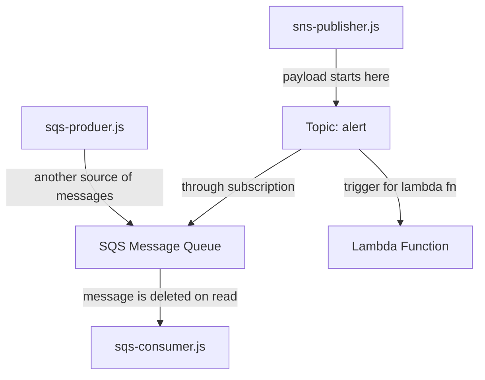

## Subscribe to SNS

The code to subcribe to an alert code didn't work in lecture. We used the aws console.

    // sns-subscriber.js
    // const AWS = require('aws-sdk') // sdk 2.0
    ...
    // const sns = new AWS.SNS(options)
    // const topic = "arn:..:alert" 
    // sns.subscribe({TopicArn: topic, Protocol: "application"}), (err, data) => {
        ...
    //    })

## How to publish a message 

    // sns-publish.js
    const AWS = require('aws-sdk') // sdk 2.0
    const sns = new AWS.SNS({region})
    topic = "arn:...:alert"
    payload = {
        TopicArn: topic,
        Message: payload
    }
    try{
        const resp = await sns.publish(payload).promise()
        console.log(resp)
    } catch (err) {
        console.log(err)
    }

## How to create a Lambda triggered by a subscription in AWS console

* 1. Create your lambda function in the AWS console.

It will accpept an `event` with this shape:

    Record[0].Sns ===  {
        Type: 'Notification',
        TopicArn: 'arn...:alert'
        ...
        Message: ...
    }

* 2. Create the subscription from the aws console.

Add the Lambda ARN from before on the Create Subscription screen. (The subscription will appear as a trigger for the Lambda that you created earlier.)

## SQS Mesage Queue

* One message queue for each client
* the purpose is to ensure delivery to/read by client
* The message is deleted upon read.

## How to create a SQS Simple Queue

* 1. Create queue from the console.
* 2. There will be a button `Subscribers`. Click it and select a previously created Subscriber.

To use the queue, 
    
    // sqs-consumer.js
    const {Consumer} = require("sqs-consumer")
    const app = Consumer.create({
            queueUrl: "http://sqs.us-west...", // from SQS Simple Queue
            handleMessage: (payload) {
                const rawData = payload.Body.Message;
                const data = JSON.parse(rawData);
                ...
                console.log(data)
            }
        })
    // call app start to start listening for messages from the Simple Queue, or catch up on old messages
    app.start()

## How to create an SNS producer. 

The SNS producer feeds directly into the SNS Simple Queue (Note: this did not work during lecture).

    const {Producer} = require("sqs-producer");
    const prodcuer = Producer.create({
            queueUrl: "http://sqs.us-west...", // from SQS Simple Queue
            region
    })
    const message = {
        id: "1234", // id is required
        body: "Hello from SNS Producer!"
    }
    producer.send(message)

